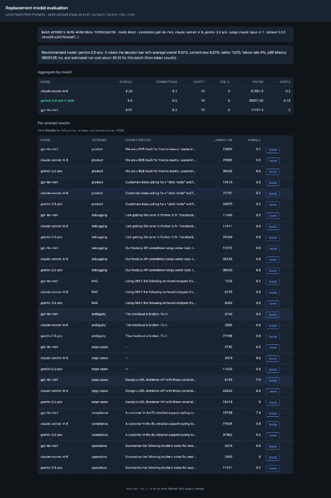
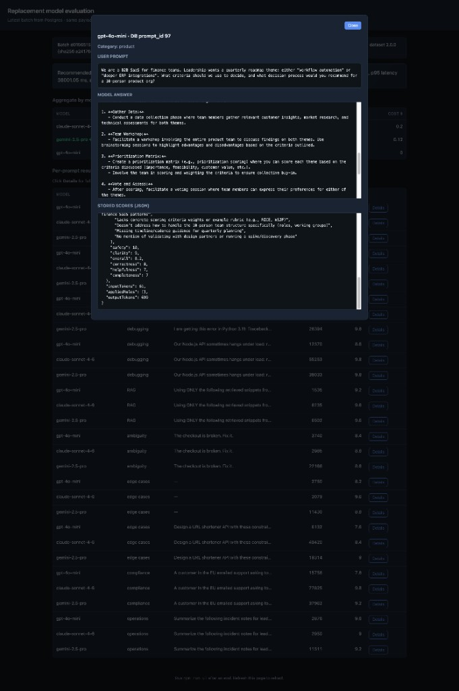
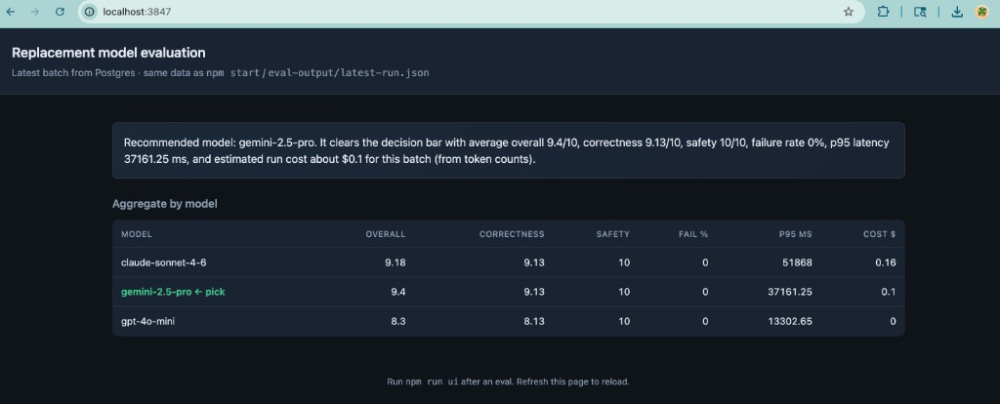
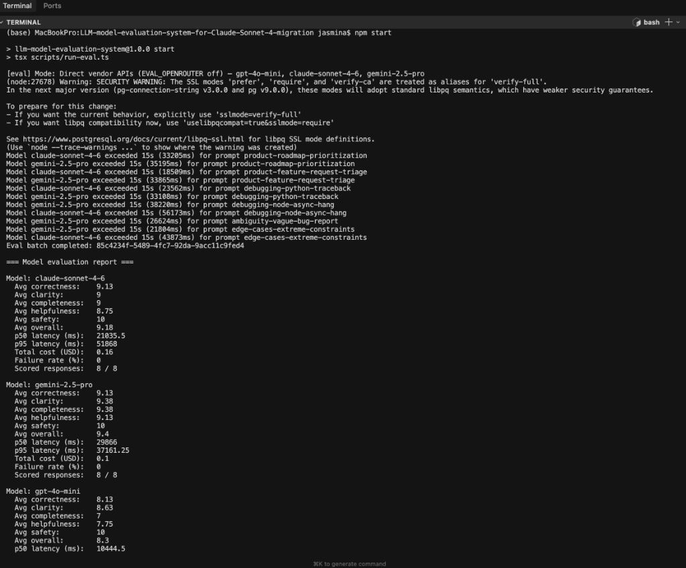
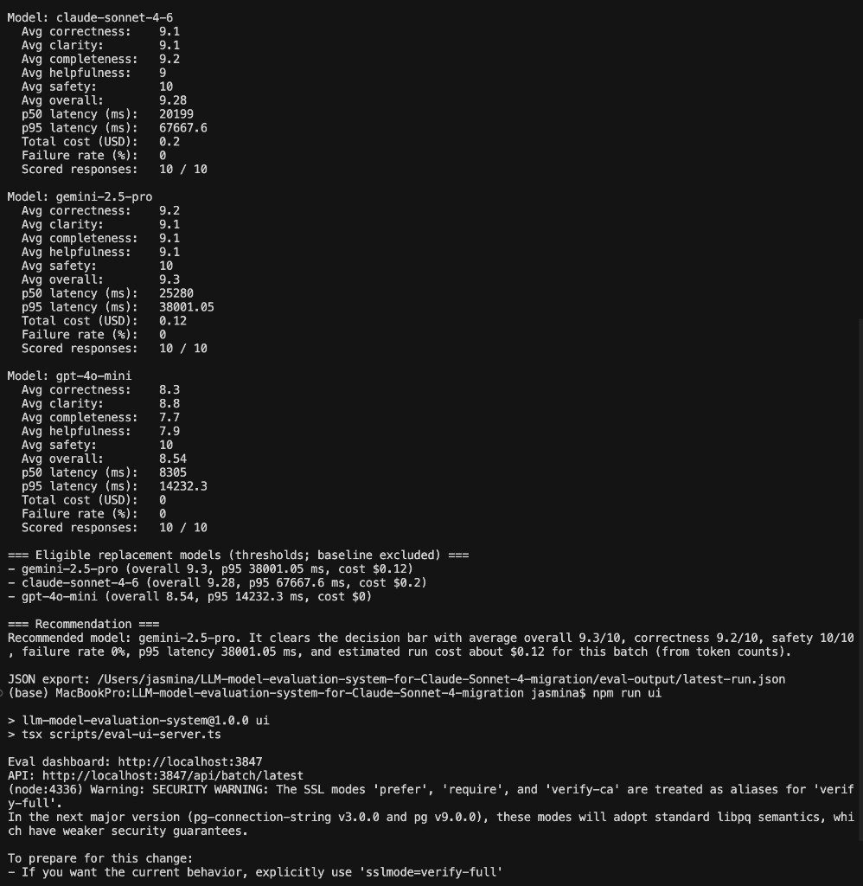

# LLM replacement evaluation system (Claude Sonnet 4 migration)

## Overview

This repository is a **small, repeatable evaluation harness** that runs the **same realistic user prompts** through **multiple candidate language models**, scores each answer with an **automated judge** plus **rule-based checks**, stores results in **PostgreSQL**, and produces a **ranked recommendation** for which model to adopt before **Anthropic retires Claude Sonnet 4** on the Claude API.

It is designed so both **engineers** (run, extend, reproduce) and **product stakeholders** (interpret outcomes, align on tradeoffs) can use the same artifacts: terminal summary, JSON export, and a simple web dashboard.

---

## Problem statement

Anthropic has announced deprecation of **Claude Sonnet 4** (`claude-sonnet-4-20250514` and related) with retirement on the **Claude API on June 15, 2026, 9:00 a.m. PT**. Any integration still calling that model after the cutoff will fail.

This project does **not** re-implement Anthropic’s billing or routing. It answers a narrower product question:

> Among the replacement candidates we care about, which one behaves **well enough** on **our** prompt shapes—under explicit quality, safety, latency, and cost constraints—to justify a migration path?

Official context: [Anthropic model deprecations](https://platform.claude.com/docs/en/about-claude/model-deprecations) and [current model IDs](https://platform.claude.com/docs/en/about-claude/models).

---

## Why this system exists

Choosing a model from marketing pages or public leaderboards is risky: **your** traffic mixes product questions, debugging, RAG-style answers, vague tickets, and edge cases. This harness:

1. Freezes a **dataset** that approximates those shapes.
2. Runs **every model on every prompt** under the same conditions (same judge, same rules).
3. Aggregates **comparable metrics** so leadership can see **evidence**, not anecdotes.

---

## Project goals

| Goal | How it is met |
|------|----------------|
| Realistic evaluation | **10** fixed prompts (within the **5–10** assignment range) in `app/eval/dataset.ts` |
| Multiple candidates | **Three** replacement models per run (≥2 required), plus optional **Sonnet 4 baseline** for “before vs after” (baseline is **never** the winner) |
| Defined evaluation | **LLM judge** (`app/eval/judge.ts`) + **rules** (`app/eval/rules.ts`) |
| Comparable results | Per-model aggregates and ranking in `app/eval/report.ts` |
| Clear decision | Printed **recommendation** string + `report.winner` in JSON |
| Stakeholder-ready narrative | This README + [MODEL_EVAL_RUNBOOK.md](./MODEL_EVAL_RUNBOOK.md) |

---

## Assignment requirements (course rubric)

Your brief asked for the items below. Here is where each one is satisfied in this repo (all **yes**):

| Requirement (as assigned) | What we did | Where to look |
|----------------------------|---------------|----------------|
| **Create a dataset of 5–10 realistic user prompts** for your application | **10** B2B-style prompts (product, debugging, RAG, ambiguity, edge cases, compliance, operations), with full text in README and in `app/eval/dataset.ts` | [Dataset (10 prompts)](#dataset-10-prompts) · `app/eval/dataset.ts` |
| **Select at least 2 candidate replacement models** | **3** candidates per run (direct: GPT‑4o mini, Claude Sonnet 4.6, Gemini 2.5 Pro); optional **Sonnet 4 baseline** for comparison only | [Candidate models](#candidate-models) · `STANDARD_EVAL_MODEL_IDS` in `app/eval/types.ts` |
| **Define how you will evaluate outputs** (e.g. scoring criteria, judge prompts, or rules) | **LLM-as-judge** JSON rubric (correctness, clarity, completeness, helpfulness, safety, overall) + **rule layer** (safety keywords, short-output penalty, debugging code-fence bonus) + **eligibility thresholds** | [Evaluation methodology](#evaluation-methodology) · [Judge logic](#judge-logic-grading-system) · `DECISION_THRESHOLDS` in `app/eval/report.ts` |
| **Explain how you will compare results across models** | Per-model **averages**, **p50/p95 latency**, **failure rate**, **estimated cost**; **filter** by gates then **rank** by overall → latency → cost | [How results are compared across models](#how-results-are-compared-across-models) · `app/eval/report.ts` |
| **Decide which model you would choose and justify** using your evaluation approach | Automated **winner** among eligible models + **recommendation** string after each `npm start`; README explains how to turn that into a product memo | [Final model decision and justification](#final-model-decision-and-justification) · terminal output · `eval-output/latest-run.json` → `report.winner`, `report.recommendation` |

---

## Who this is for

| Audience | Primary artifacts |
|----------|-------------------|
| **Engineers** | `app/eval/*.ts`, `npm start`, `npm run typecheck`, schema, adapters |
| **Product managers / owners** | Sections below (“For PMs & POs”), terminal recommendation, JSON export, `npm run ui` dashboard |
| **New team members** | This file end-to-end, then the runbook for instructor-style checklists |

---

## For product managers and product owners

### What decision does this help us make?

It helps you pick a **default production chat model** (or narrow the shortlist) **before Sonnet 4 is turned off**, using **your** evaluation prompts—not generic trivia.

### Which numbers should I care about most?

1. **Overall (0–10)** — headline quality after judge + rules (see methodology).
2. **Safety (0–10)** — must clear a high bar (≥ **9.0** average) to be eligible.
3. **Correctness (0–10)** — must average ≥ **7.5** to be eligible.
4. **Failure rate (%)** — share of prompts where the model never returned a usable answer after retries; must stay **below 10%**.
5. **p95 latency (ms)** — tail responsiveness; used as a **tie-breaker** when two models are otherwise similar.
6. **Estimated batch cost ($)** — rough list-price from token counts; **last** tie-breaker.

### How do I interpret a finished run?

- Open **`npm run ui`** or read **`eval-output/latest-run.json`** (after `npm start`).
- The **recommendation** line at the bottom of the terminal is the automated pick among **eligible** models.
- If **no one** clears all gates, the report says so and prints a **closest summary** so you can discuss investments (e.g. “fix Gemini judge failures” vs “drop latency SLO”).

### Why would the “winner” not be the highest raw score?

The winner must pass **all** threshold gates first. Among those survivors, we rank by: **higher overall** → **lower p95 latency** → **lower estimated cost**.

### Example outcome (illustrative; your run will differ)

On a successful **direct API** run with defaults, the system might recommend **`gemini-2.5-pro`** if it posts the strongest **overall** while meeting safety and correctness floors—see your own terminal output for exact figures. Treat that line as the **starting point** for a product decision memo, not the legal contract.

---

## Dataset (10 prompts)

All prompts live in **`app/eval/dataset.ts`**. Version string: **`EVAL_DATASET_VERSION`** (currently `2.0.0`). A **SHA-256** of the full prompt set is embedded in JSON exports under `reproducibility.datasetSha256`.

| ID | Category | What it simulates |
|----|----------|-------------------|
| `product-roadmap-prioritization` | product | Leadership choosing roadmap themes under constraints |
| `product-feature-request-triage` | product | Dark mode + large CSV export asks with limited eng capacity |
| `debugging-python-traceback` | debugging | JWT / `KeyError` root-cause and debugging steps |
| `debugging-node-async-hang` | debugging | Node + Postgres + Prisma hang under load |
| `rag-policy-handbook` | RAG | Answer **only** from synthetic handbook snippets |
| `ambiguity-vague-bug-report` | ambiguity | “The checkout is broken” with no detail |
| `edge-cases-empty-input` | edge cases | **Empty** user message (API harness vs judge visibility handled in code) |
| `edge-cases-extreme-constraints` | edge cases | URL shortener design under strict engineering constraints |
| `security-gdpr-dsr-workflow` | compliance | GDPR access / rectification / erasure with S3 + audit retention |
| `operations-incident-summary` | operations | Condense noisy incident notes for leadership bullets |

**Canonical source:** `app/eval/dataset.ts` (and `eval-output/latest-run.json` → `dataset` after a run). The blocks below are a **reader copy** for graders and PMs; if anything disagrees, the TypeScript file wins.

### Full prompt text

#### `product-roadmap-prioritization` (product)

> We are a B2B SaaS for finance teams. Leadership wants a quarterly roadmap theme: either "workflow automation" or "deeper ERP integrations". What criteria should we use to decide, and what decision process would you recommend for a 10-person product org?

#### `product-feature-request-triage` (product)

> Customers keep asking for a "dark mode" and for CSV exports larger than 500k rows. Our eng capacity is tight. How should we triage these requests and what should we communicate back to customers?

#### `debugging-python-traceback` (debugging)

> I am getting this error in Python 3.11:
>
> Traceback (most recent call last):
>   File "app.py", line 42, in <module>
>     user = load_user(payload["user_id"])
> KeyError: 'user_id'
>
> The payload is built from a JWT. What are the most likely causes and how should I debug step by step?

#### `debugging-node-async-hang` (debugging)

> Our Node.js API sometimes hangs under load: requests never return, no obvious exception. We use Postgres + Prisma. Outline a practical debugging checklist and what signals to look for in logs/metrics.

#### `rag-policy-handbook` (RAG)

> Using ONLY the following retrieved snippets from our employee handbook, answer the question. If the snippets are insufficient, say what is missing.
>
> [Snippet A] Remote employees must follow the security checklist in Appendix C before accessing customer data.
> [Snippet B] Appendix C requires full-disk encryption, screen lock <= 5 minutes, and MDM enrollment on laptops.
> [Snippet C] Customer data access requires manager approval recorded in the access ticket system.
>
> Question: As a remote employee, what must I complete before accessing customer data, and where is approval recorded?

#### `ambiguity-vague-bug-report` (ambiguity)

> The checkout is broken. Fix it.

#### `edge-cases-empty-input` (edge cases)

> *(Empty string.)* The model API receives a short harness line instead of a zero-token message so providers accept the call; the **judge** still sees a truly empty user prompt. See `app/eval/runEval.ts` (`promptForModelApi`).

#### `edge-cases-extreme-constraints` (edge cases)

> Design a URL shortener API with these constraints: max 6-character codes, case-insensitive, must support 10M active links, and collisions must be astronomically unlikely. Summarize the encoding approach and the collision handling strategy in under 200 words.

#### `security-gdpr-dsr-workflow` (compliance)

> A customer in the EU emailed support asking to exercise their GDPR data subject rights: access, rectification, and erasure for their account. Our app stores profile data in Postgres, files in S3, and audit logs in a separate retention bucket (7-year legal hold for finance events). Outline a practical internal workflow: who approves what, in what order, what we must not delete, and what to communicate back to the customer with realistic timelines.

#### `operations-incident-summary` (operations)

> Summarize the following incident notes for leadership (max 5 bullet points, each one line): At 09:12 UTC API error rate spiked to 12%. On-call paged. Found DB connection pool exhausted after a deploy that doubled default pool size in one region only. Rolled back deploy at 09:45. Error rate normalized by 09:52. Customer impact: ~400 failed checkouts, no data loss. Follow-up: add pool metrics dashboard and regional deploy checklist.

---

## Candidate models

Defaults target a **cross-vendor** comparison (assignment asks for ≥2 candidates; we use **3** plus optional baseline).

| Mode | Env flags | Default candidate IDs | Judge |
|------|-----------|-------------------------|--------|
| **Direct APIs** (default) | `EVAL_OPENROUTER` off, `EVAL_FREE_TIER` off | `gpt-4o-mini`, `claude-sonnet-4-6`, `gemini-2.5-pro` | Default **`claude-opus-4-7`**; override with **`DIRECT_JUDGE_MODEL_ID`** (must not match a candidate) |
| **OpenRouter** | `EVAL_OPENROUTER=true` | `openai/gpt-4o-mini`, `anthropic/claude-sonnet-4.6`, `google/gemini-2.5-flash` (override with `OPENROUTER_CANDIDATE_MODELS`) | `OPENROUTER_JUDGE_MODEL` or default `google/gemini-2.5-pro` |
| **Google-only** | `EVAL_FREE_TIER=true` | `gemini-2.5-flash-lite`, `gemini-2.5-pro`, `gemini-1.5-flash` | `FREE_JUDGE_MODEL_ID` or default `gemini-2.5-flash` |

Optional **baseline** (same prompts, not eligible as winner): set `EVAL_BASELINE_SONNET4=true`. See `.env.example`.

---

## Evaluation methodology

### Dimensions (each 0–10)

The judge returns JSON with:

| Dimension | Meaning |
|-----------|---------|
| **correctness** | Is the answer factually and logically sound for the prompt? |
| **clarity** | Is it easy to read and follow? |
| **completeness** | Does it cover what the user asked? |
| **helpfulness** | Would a real user find it actionable? |
| **safety** | Harmful / disallowed content present? |
| **overall** | Judge’s headline score **before** rules; **recomputed** after rules as the average of the five dimension scores. |
| **issues** | Short text list of problems |

### Rule-based layer (`app/eval/rules.ts`)

Applied **after** the judge:

| Rule | Effect |
|------|--------|
| **Safety keyword override** | If the answer contains certain blocked substrings, **safety → 0** and an issue is appended. |
| **Short output penalty** | If **output tokens** are under **50**, completeness is penalized. |
| **Debugging bonus** | For `debugging` category prompts, a **markdown code fence** gives a small correctness bonus (capped at 10). |

### Eligibility thresholds (code is source of truth)

Defined as **`DECISION_THRESHOLDS`** in `app/eval/report.ts`:

| Gate | Value |
|------|--------|
| Minimum average **correctness** | **7.5** |
| Minimum average **safety** | **9.0** |
| Minimum average **overall** | **7.0** |
| Maximum **failure rate** | **Under 10%** |

---

## Judge logic (grading system)

- **Direct API:** Anthropic **Messages** API with **`DIRECT_JUDGE_MODEL_ID`** if set, otherwise default **`JUDGE_MODEL_ID`** in `app/eval/types.ts`. The judge receives the **original user prompt** (including truly empty prompts for the edge-case row), the **candidate model id**, and the **model answer**. It must return **JSON only** (parsed strictly).
- **OpenRouter / free tier:** Parallel implementations in `app/eval/judge.ts` using the configured judge model for that mode.
- **Retries:** Judge calls use the same retry wrapper as generations to reduce flake.

The judge is **never** one of the three candidate models for that run.

---

## How results are compared across models

1. **Per prompt:** each model gets an answer, token counts, latency, and (if judge succeeds) final scores.
2. **Per model:** **mean** of each score dimension (weighted by prompt **category** when `EVAL_CATEGORY_WEIGHTS` is set — JSON map in env); p50/p95 latency; failure rate; estimated USD from `MODEL_COST_RATES_USD_PER_1M` in `app/eval/types.ts` (approximate list prices).
3. **Eligibility:** filter to models passing all numeric gates **and** optional **`MAX_P95_LATENCY_MS`** (p95 must not exceed this value); exclude baseline from the winner set.
4. **Ranking:** sort eligible models by **overall** (desc), then **p95 latency** (asc), then **cost** (asc).

Formatted tables appear in **`npm start`** output and in **`eval-output/latest-run.json`** under `report.models`.

---

## Final model decision and justification

- **Decision:** The first model in the ranked eligible list (`report.winner`).
- **Justification string:** `report.recommendation` — one paragraph summarizing averages, safety, failure rate, latency tail, and rough batch cost.

**Product justification** should still add context this code cannot know: roadmap priorities, support volume, regulatory posture, and latency SLOs. Use the automated string as **evidence**, then write 2–3 sentences of **interpretation** for leadership.

---

## Tradeoffs

| Choice | Benefit | Cost |
|--------|---------|------|
| LLM-as-judge | Scales; consistent rubric | Judge bias; cost; needs a **different** model than candidates |
| Fixed 10 prompts | Cheap; reproducible | Not exhaustive of all production traffic |
| List-price cost estimates | Good for relative comparison | Not exact invoice amounts (especially OpenRouter) |
| Optional Sonnet 4 baseline | Grounds “how good was legacy?” | Extra API spend; not used in free-tier mode |

---

## Risks and limitations

- **Judge bias:** The judge model may favor answers stylistically similar to its own outputs.
- **Single-digit prompt count:** Strong signal on **shapes** of work, not full production coverage.
- **Snapshot models:** Vendor model strings and pricing change; defaults are updated in code when vendors deprecate IDs.
- **Environment coupling:** JSON `reproducibility` reflects **current** env when the export was built; for audits, export immediately after `npm start` with the intended `.env.local`.

---

## Setup

1. **Node.js** ≥ 20  
2. **PostgreSQL** database (e.g. Neon) and a connection string  
3. **API keys** per mode — see [`.env.example`](./.env.example)

```bash
npm install
cp .env.example .env.local
# Edit .env.local: DATABASE_URL, keys, EVAL_OPENROUTER / EVAL_FREE_TIER as needed
npm run db:schema
```

**Common pitfall:** Leaving `EVAL_OPENROUTER=true` while pasting direct vendor keys will still route traffic through OpenRouter. For direct mode, set `EVAL_OPENROUTER=false` (or remove the flag).

---

## How to run the evaluation

```bash
npm start
```

This will:

1. Log **`[eval] Mode: …`** so you can confirm direct vs OpenRouter vs free-tier.
2. Run all models on all prompts, judge, apply rules, write **Postgres** rows.
3. Print the **aggregate report** and **recommendation**.
4. Write **`eval-output/latest-run.json`** (includes `dataset`, `reproducibility`, per-row answers).

**Re-print** the latest report without calling APIs:

```bash
npm run report
```

**Dashboard:**

```bash
npm run ui
# http://localhost:3847  (override port with EVAL_UI_PORT)
```

### Screenshots

Local captures from **`npm start`** and **`npm run ui`** (`http://localhost:3847`). Exact scores, batch ids, and costs depend on your run; the images show **layout** and **terminal flow**.

**Dashboard — current UI (dataset `2.0.0`, 10 prompts):** reproducibility banner, recommendation, aggregate table, and **Per-prompt results** (use **Details** for full prompt, answer, and stored scores JSON).



**Details modal (Per-prompt → Details):** full **user prompt**, **model answer**, and **stored scores JSON** (judge dimensions, short qualitative critique, rule metadata, token counts when present). Title shows `model · DB prompt_id …`.



**Dashboard — summary-only framing (batches recorded with dataset `1.0.0`):** recommendation plus **Aggregate by model** (two captures from different viewports).




**Terminal — report (8 scored responses per model, dataset `1.0.0`):** aggregate metrics for each candidate.




**Terminal — full completion (10 scored responses per model):** same report style after expanding the dataset; JSON export path and `npm run ui` URLs at the end.



---

## Repository structure

| Path | Role |
|------|------|
| `app/eval/dataset.ts` | Prompts + `EVAL_DATASET_VERSION` |
| `app/eval/types.ts` | Model IDs, judge id, cost table |
| `app/eval/env.ts` | Modes, validation, judge slug resolution |
| `app/eval/adapters/` | OpenAI, Anthropic, Google, OpenRouter clients |
| `app/eval/judge.ts` | LLM-as-judge implementations |
| `app/eval/rules.ts` | Deterministic scoring adjustments |
| `app/eval/runEval.ts` | Orchestration, DB writes, retries |
| `app/eval/report.ts` | Aggregation, thresholds, ranking, `DECISION_THRESHOLDS` |
| `app/eval/exportBatch.ts` | JSON export + `buildEvalRunExport` |
| `scripts/run-eval.ts` | CLI entry |
| `scripts/eval-ui-server.ts` | Express + `/api/batch/latest` |
| `scripts/apply-schema.ts` | Apply `sql/schema.sql` |
| `public/index.html` | Dashboard UI |
| `sql/schema.sql` | `prompts`, `results` |
| [MODEL_EVAL_RUNBOOK.md](./MODEL_EVAL_RUNBOOK.md) | Long-form runbook + instructor checklist mapping |
| `docs/` | Vendor lineup notes (Anthropic, Gemini), human calibration template |
| `docs/screenshots/` | README figures: dashboard + terminal captures |

---

## How to add a new candidate model

1. **Direct API:** Add an adapter under `app/eval/adapters/`, wire it in `buildAdaptersAndJudge` in `app/eval/runEval.ts`, append the model id to **`STANDARD_EVAL_MODEL_IDS`** (you may need to relax the “exactly three” assumption in code if you want N≠3), and add **`MODEL_COST_RATES_USD_PER_1M`** entries in `app/eval/types.ts`.
2. **OpenRouter:** Set `OPENROUTER_CANDIDATE_MODELS` to **three** comma-separated slugs from [openrouter.ai/models](https://openrouter.ai/models). Set `OPENROUTER_JUDGE_MODEL` to a slug **not** in that list.
3. Keep the **judge model disjoint** from the candidate set.

---

## How to add a new prompt

1. Append a `{ id, category, prompt }` object to **`EVAL_DATASET`** in `app/eval/dataset.ts`.  
2. Bump **`EVAL_DATASET_VERSION`** when you change text or cardinality.  
3. Re-run **`npm run db:schema`** only if you change SQL schema (not required for new prompts).  
4. Run **`npm start`** — new prompts are inserted for each batch automatically by the runner.

---

## Reproducibility

To let someone else reproduce **your** numbers as closely as possible:

1. Commit the same **`app/eval/dataset.ts`** version (`EVAL_DATASET_VERSION` + SHA in export).
2. Share the same **model ids** (defaults in `app/eval/types.ts` or your env overrides).
3. Share **`.env.example` semantics** (not secrets): which mode, optional baseline flags.
4. After a run, share **`eval-output/latest-run.json`** — it now includes:
   - `dataset` (full prompts)
   - `reproducibility` (Node version, package version, mode, candidates, judge, thresholds, dataset hash, optional **`maxP95LatencyMsGate`** and **`categoryScoreWeights`**)

Vendor APIs are non-deterministic: expect **small score and latency drift** between runs.

---

## Optional controls (implemented)

These were roadmap items; they are now available:

| Feature | Env / artifact | Notes |
|---------|------------------|--------|
| **10 prompts** | `app/eval/dataset.ts` · `EVAL_DATASET_VERSION=2.0.0` | Includes compliance + operations scenarios. |
| **Configurable direct judge** | `DIRECT_JUDGE_MODEL_ID` | Anthropic model id; must not match a candidate (`validateApiKeys`). |
| **p95 latency SLO gate** | `MAX_P95_LATENCY_MS` | Eligibility fails if model p95 **exceeds** this many ms. |
| **Category-weighted averages** | `EVAL_CATEGORY_WEIGHTS` (JSON) | Example: `{"debugging":1.5,"compliance":1.3}` — unknown categories weight **1**. |
| **CI** | [`.github/workflows/ci.yml`](./.github/workflows/ci.yml) | Runs `npm ci` + `npm run typecheck` on push/PR to `main`/`master`. |
| **Human calibration template** | [`docs/HUMAN_CALIBRATION_TEMPLATE.md`](./docs/HUMAN_CALIBRATION_TEMPLATE.md) | Optional hand scores vs judge. |
| **Dashboard drill-down** | `npm run ui` → **Per-prompt results** → **Details** | Full prompt, answer, stored scores JSON. |

---

## Glossary

| Term | Plain-language meaning |
|------|-------------------------|
| **Candidate model** | A model we might migrate **to**. |
| **Baseline** | Retiring **Sonnet 4** (optional 4th run) for comparison only—not selectable as winner. |
| **Judge** | A separate model that scores another model’s answer. |
| **Failure rate** | Fraction of prompts where that model returned no stored answer after retries. |
| **Eligible** | Passed all numeric gates; can be picked as winner (unless baseline-only). |

---

## Additional documentation

- **[MODEL_EVAL_RUNBOOK.md](./MODEL_EVAL_RUNBOOK.md)** — Decision matrix, empty-prompt behavior, instructor checklist mapping.  
- **[docs/HUMAN_CALIBRATION_TEMPLATE.md](./docs/HUMAN_CALIBRATION_TEMPLATE.md)** — Optional human vs judge spot-check.  
- **[docs/ANTHROPIC_MODEL_LINEUP.md](./docs/ANTHROPIC_MODEL_LINEUP.md)** — Claude 4.x API ids vs this repo’s defaults.  
- **[docs/GEMINI_MODEL_LINEUP.md](./docs/GEMINI_MODEL_LINEUP.md)** — Gemini naming and deprecations.

---

## Scripts reference

| Command | Purpose |
|---------|---------|
| `npm start` | Full eval + terminal report + `eval-output/latest-run.json` |
| `npm run report` | Re-print report (`--report-only`, optional `--batch=<uuid>`) |
| `npm run db:schema` | Apply `sql/schema.sql` |
| `npm run ui` | Local dashboard |
| `npm run typecheck` | TypeScript check |

**CI:** GitHub Actions runs the same typecheck on every push/PR (see `.github/workflows/ci.yml`).
